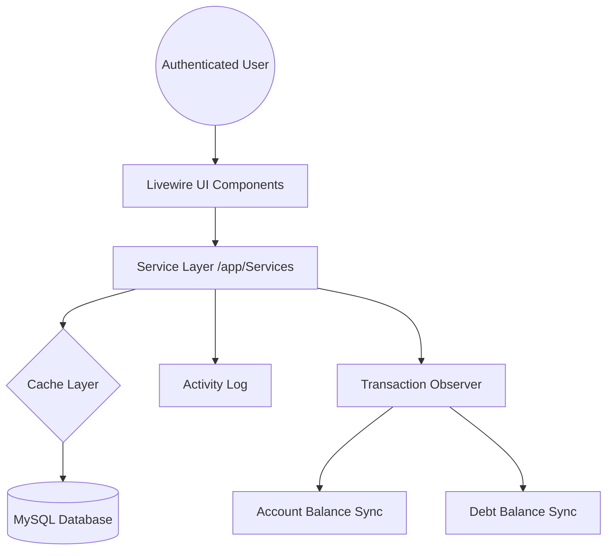

# TrackMyExpenses

A "finance-minimalist" personal wealth tracker built with Laravel 12 and Livewire 4.


## 🎨 The Philosophy: Finance-Minimalist
TrackMyExpenses isn't just a tool; it's a design statement. Its beauty lies in:
- **Zero Clutter:** No unnecessary borders, shadows, or heavy containers.
- **Typography First:** Leveraging **IBM Plex Sans** for readability and **IBM Plex Mono** for all financial values.
- **High Contrast:** A monochrome surface palette (`#f5f4f0` canvas) with semantic financial accents.
- **Responsive Native-Feel:** A mobile-first UI with smooth transitions, collapsible sidebars, and animated KPI counters.

---

## 🚀 Core Features

### 💎 Intelligent Management (Livewire Powered)
- **Real-time Accounts:** Manage Bank, Cash, and Credit accounts with instant balance updates.
- **Smart Budgets:** Categorized monthly limits with live progress bars that color-code based on utilization.
- **Debt Tracking:** Track Lent/Borrowed money with integrated payment recording and automated balance syncing.
- **Advanced Transactions:** A powerful history list with real-time search, multi-column filtering, and reactive sorting.

### 🛡️ Security & Integrity
- **Comprehensive Auditing:** Every financial change is logged using **Spatie Activity Log v5**, providing a full "who changed what" trail.
- **Soft Deletion:** Financial history is never truly lost; critical models use `SoftDeletes`.
- **Import Guards:** Secure CSV/PDF statement imports with file size limits and DoS protection (5000 row limit).
- **Throttling:** Global rate limiting on all critical financial actions to prevent automated abuse.

### ⚡ Performance Optimized
- **Dashboard Caching:** Smart 5-minute query caching with automated invalidation on transaction changes.
- **Database Indexing:** Composite performance indexes for lightning-fast monthly summaries and historical trends.
- **Timezone Aware:** Global enforcement of user-specific timezones for accurate date reporting.

---

## 🏗️ System Architecture



---

## 🛠️ Tech Stack
- **Framework:** Laravel 12.x
- **UI:** Livewire 4.x (TALL Stack)
- **Styling:** TailwindCSS 3.x (JIT)
- **Interactions:** Alpine.js 3.x
- **Icons:** Custom SVG Minimalist Set
- **Charts:** Chart.js 4.x

---

## 🏁 Getting Started

### Installation
```bash
composer install
npm install && npm run dev
php artisan migrate --seed
```

### Development Standards
- **Logic Placement:** ALL business logic must reside in `app/Services`.
- **UI Consistency:** Use existing Blade components (`x-panel`, `x-kpi-card`, `x-badge`).
- **Formatting:** Run `vendor/bin/pint` before every commit.
- **Verification:** Every change requires a corresponding feature test in `tests/Feature`.

---

## 📖 Session Progress (April 4, 2026)
Today, the following components were migrated from legacy static views to modern, reactive Livewire implementations:
- [x] **CategoryManager:** With unique user-scoping and system protection.
- [x] **AccountManager:** Full CRUD with Feature Tests.
- [x] **BudgetManager:** Live utilization tracking and period navigation.
- [x] **DebtManager:** Integrated payment workflow and auto-sync.
- [x] **TransactionList:** Advanced filtering and query-string syncing.
- [x] **UserSettings:** Personalization for Currencies and Timezones.
- [x] **UI Revamp:** Mobile-first responsive layout and global animations.

---
*Built with ❤️ for financial clarity.*
