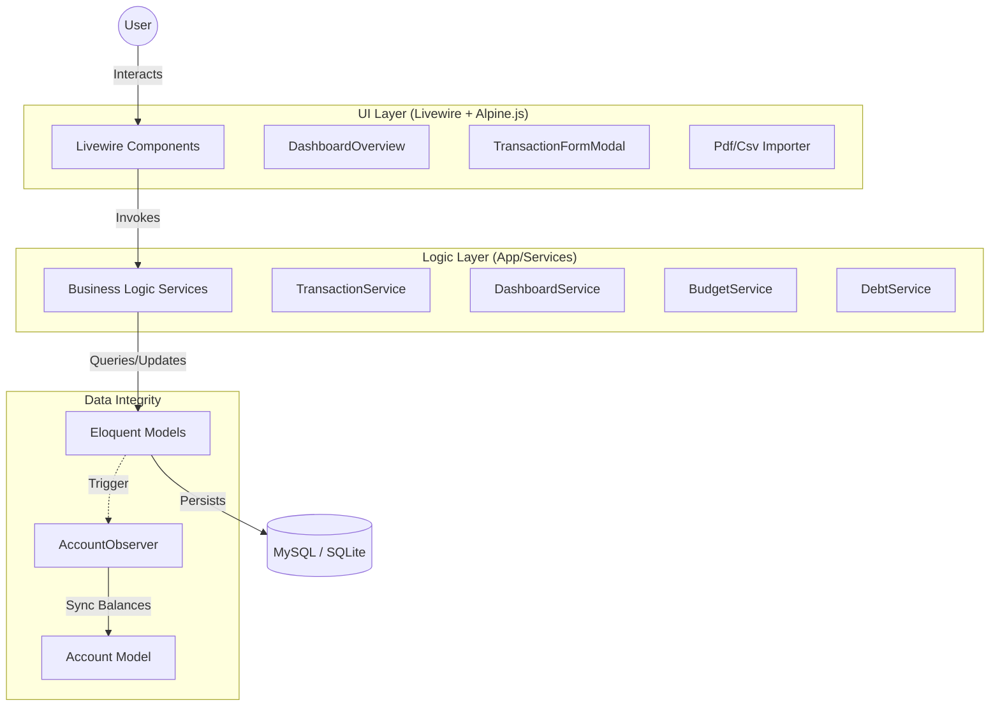

# 📊 TrackMyExpenses

A "finance-minimalist" application designed for high contrast, clear typography, and a zero-clutter interface. Built with the **Laravel 12 TALL stack**, it prioritizes financial clarity through a professional, monochrome aesthetic with vibrant financial accent colors.

---

## 🏗️ Architectural Overview

TrackMyExpenses follows a strict **Service-Layer Architecture** to decouple business logic from the UI and transport layers. This ensures that the application remains maintainable, testable, and scalable.

### 🔄 Visual Workflow



### 🧠 Technical Philosophy & Choices

#### 1. The TALL Stack (Tailwind, Alpine.js, Laravel, Livewire)
- **Why?** It allows for building rich, reactive interfaces (like the interactive dashboard and real-time form validation) without the overhead of a heavy JavaScript framework.
- **Purpose:** By keeping the state on the backend with Livewire, we maintain a single source of truth and reduce the complexity of the build pipeline.

#### 2. Service-Layer Design
- **Why?** Controllers and Livewire components are treated as "entry points" only. All complex calculations, transaction logic, and data transformations reside in `app/Services`.
- **Purpose:** This makes the logic reusable across different parts of the app (e.g., CLI commands or API endpoints) and simplifies unit testing.

#### 3. Automatic Data Integrity (Observers)
- **Why?** When a transaction is created, updated, or deleted, the associated account balance must stay in sync.
- **Purpose:** Using `AccountObserver` ensures that these side effects happen automatically and reliably, preventing "drifting" balances.

#### 4. Minimalist UI (IBM Plex + Finance Accents)
- **Why?** Financial data should be readable at a glance. We use `font-mono` for all currency and date values to ensure perfect alignment.
- **Purpose:** High contrast between monochrome surfaces and accent colors (`text-finance-green` for income, `text-finance-red` for expenses) provides immediate visual feedback.

---

## ✨ Key Features

- **🎯 KPI Dashboard:** Real-time tracking of Income, Expenses, and Savings Rate.
- **💰 Budget Health:** Global and category-specific budget monitoring with visual progress bars.
- **📈 Historical Trends:** 6-month historical income vs. expense comparison.
- **🤝 Debt Management:** Dedicated tracking for money lent/borrowed with automatic settlement syncing.
- **📂 Smart Importers:** Support for both CSV and PDF statement imports to automate data entry.
- **🧪 Robust Testing:** 100% logic coverage using PHPUnit with SQLite in-memory databases.

---

## 🛠️ Tech Stack

- **Framework:** Laravel 12.x
- **Frontend:** Livewire 4.x, Alpine.js 3.x
- **Styling:** Tailwind CSS 3.x
- **Typography:** IBM Plex Sans & IBM Plex Mono
- **Database:** MySQL (Local Dev) / SQLite (Testing)

---

## 🚀 Getting Started

### Prerequisites

- PHP 8.4+
- Composer
- Node.js & NPM

### Installation

1. **Clone & Install:**
   ```bash
   git clone https://github.com/sreeramp96/trackmyexpenses.git
   cd trackmyexpenses
   composer install
   npm install && npm run build
   ```

2. **Environment Setup:**
   ```bash
   cp .env.example .env
   php artisan key:generate
   ```

3. **Database Migration & Seeding:**
   ```bash
   php artisan migrate --seed
   php artisan db:seed --class=DummyDataSeeder
   ```

### Demo Access

- **Login:** `sreeram@demo.com`
- **Password:** `password`

---

## 📏 Development Standards

- **Linting:** We use `php artisan pint` for consistent code styling.
- **Logic Placement:** Strictly no business logic in Controllers or Livewire components. Use Services.
- **UI Components:** Use predefined Blade components (`x-panel`, `x-kpi-card`, `x-badge`) to maintain design consistency.
- **Soft Deletes:** All `Transaction` and `Debt` models use `SoftDeletes` to preserve financial history.

---
Built with ❤️ for financial clarity.
